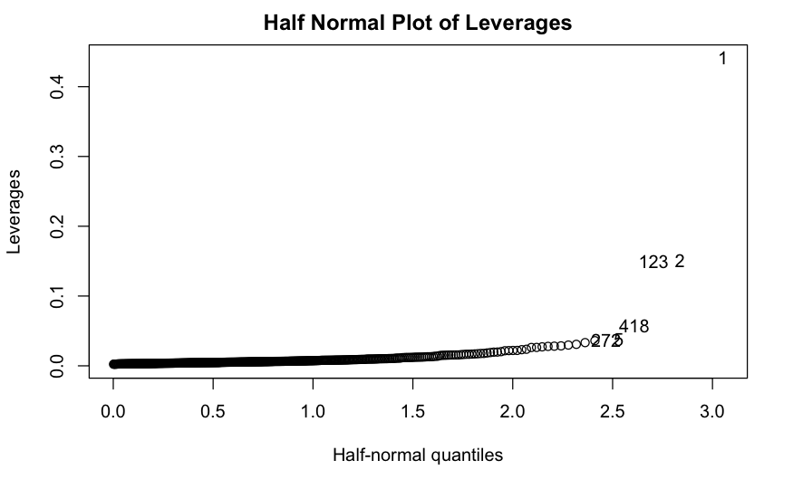

\newpage
\tableofcontents
\newpage
## 1. Introduction

Due to the pandemic, there have been severe shortages in medical staff for many cities and counties around the nation. There is an article that discusses the severity of this issue of medical staff shortages, especially if correcting measures are not taken as soon as possible. Therefore, numerous government bodies and city planning committees have started discussing the ratios of medical staff to population or hospital resources. The goal in this case study is to attempt to create a regression model for predicting the number of practicing physicians though county attributes from the years 1990 and 1992. The data set provides selected county demographic information (CDI) for 440 of the most populous counties in the United States.

Link to the article: \textcolor{blue}{(https://www.ama-assn.org/practice-management/sustainability/doctor-shortages-are-here-and-they-ll-get-worse-if-we-don-t-act)}

## 2. Cleaning Up and Visualizing the Dataset

Viewing the dataset, we observed that the `Identification Number` column held no significant information that would help perform the regression analysis. The `County` and `State` column were also removed from this regression to avoid over fitting based on geographic indicators in order to favor a model that would be more versatile by only considering the county's attribute instead of already known information about the county. Based on these observations, we removed these unnecessary columns. We created a frequency histogram of the number of active physicians as well as an empirical distribution graph so we can better understand how this data is distributed We saw that 75% of the response values were below 1036.0, while the maximum value was 23677.0. Additionally, we printed the descriptive statistics of each predictor to gain better insight on the data as a whole.

## 3. Reconfiguring the data

We noticed that a majority of the variables were represented as percentages. Based on this observation, we divided the features `Number of Hospital Beds` and `Total Serious Crimes` which were not percentages, by the column `Total Population` to view the data values as percentages.

Our next step was that we produced a correlation matrix to determine which predictors were influencing other predictors. We noticed that the `Total Population` of the county variable held high correlation with `Total Personal Income` feature, so we were motivated to drop the former column. Before we did, we ran an F-test to determine whether the reduced model (model without Total Population column) was adequate. Unsurprisingly, it was, because 0.1171 , our p-value, was greater than our $\alpha$, (set at 0.05), therefore, we failed to reject the null hypothesis, and deemed that the reduced model was adequate. Ergo,we removed `Total Population` of the county column from our dataset\*. We had the following correlation matrix after these changes to the dataset.

## 4. Permutation Testing, Backward Selection & More Tests

From the full model we identified that the predictors, `Percentage of Hospital Beds`, `Percent of Bachelor’s Degrees`, `Percent of Population Below the Poverty Level`, and `Total Personal Income` had significance levels less than .05, which is ideally what we are looking for. The rest of the predictors in the dataset held p-values greater than $\alpha = 0.05$. We decided to perform a permutation test to determine if we were able to remove the high p-value predictors from the model without compromising adequacy.

We ran a permutation test where the Null Hypothesis was that reduced model is adequate. The permutation test function returned a p-value of 0.452 which is greater than $\alpha = 0.05$, which means that these predictors would be something that could be potentially removed. Next, we used an backwards selection algorithm to ensure we chose the appropriate predictors to keep, which kind of behaved like our check step for the features we kept after the suggestion of permutation test. This modified test tested whether a predictor could be removed based on the significance of its coefficients, an anova test with the full model, and a permutation test against the full model. All three were not needed, but were kept to make the processes of removing predictors more conservative.

The backwards selection algorithm determined that our chosen parameters were valid. We ran an F test to determine whether the reduced model (model included `Percentage of Hospital Beds`, `Percent of Bachelor’s Degrees`, `Percent of Population Below the Poverty Level`, and `Total Personal Income`) was adequate. Since the p-value came out to be 0.3809, which is greater than $\alpha = 0.05$, we failed to reject the null hypothesis, and deemed the reduced model is adequate.

We additionally, played around and performed additional testing with the data, we found that reduced model with `Percentage of Hospital Beds`, `Total Personal Income` and the combined predictor of (`Percent of Bachelor’s Degrees + Percent of the Population Below the Poverty Level`) was adequate as the p-value associated was equal to 0.1923 which is obviously greater than $\alpha = 0.05$. This was the finalized or chosen\*\* reduced model that had the same coefficient for `Percent of Bachelor’s Degrees` and `Percent of the Population Below the Poverty Level` which had a $R^2$ value of 0.938, and an adjusted-$R^2$ of 0.9376.

\*\* *All diagnostics measures and analysis were run on this chosen reduced model, unless otherwise mentioned.*

## 5. Model Assumptions

First, we tested for the constant variance assumption. We created a plot of our reduced model residuals against the fitted values. The plot showed a discernible pattern, to be specific, a very dense and tight-knit cluster of points showing significant overlap on the lower end of the fitted values. This can be seen in the following plot:

This alluded that the variance was neither random nor constant, and there could possibly be a violation of the Constant-Variance assumption. To dig deeper, we ran a studentized Breusch-Pagan test (BP test), where our p-value turned out to be equal to $1.689*10^{-9}$ which is obviously less than $\alpha = 0.05$, confirming the hunch that the constant variance assumption was not satisfied.

We decided to see if applying any transformations to the data could maneuver the data towards something that would allow us to uphold the variance assumption.

Our first attempt was to apply the square root transformation, but this transformation's residual plot yielded the same issues as the original model. We ran the BP test that resulted in a p-value of $2.2*10^{-16}$ which is again less than $\alpha = 0.05$, again leading to the conclusion that the constant variance assumption is not satisfied.

Next, we attempted to applied the logarithmic transformation, where the plot showed similar patterns to the full model that suggested constant variance assumption was not holding true, and the BP test gave a p-value of $2.2* 10^{-16}$ which is again less than $\alpha = 0.05$, which tells us that the constant variance assumption was not satisfied.

We persisted and decided to apply an inverse transformation. The residuals against fitted values plot still did yield similar significant patterns, however, the BP test yielded a slightly higher p-value of .0002512 (relative to the other transformations done previously). This p-value was still too small compared to the $\alpha = 0.05$, and the constant variance assumption was not fulfilled. The step held the importance of guiding us towards variation of inverse transformations.

Keeping this in mind, we applied an inverse squared transformation. Although, the residuals against the fitted values plot relatively did have more smoothness and consistency in variance (compared to previous iterations), and running the BP test gave us a p-value of 0.2981 which is greater than $\alpha$, so we concluded the constant variance assumption was satisfied, using the mentioned transformation (inverse-squared).

With this transformation, we tried to refit our model accordingly, however, it damaged our new $R^2$-value as it equated to 0.1677 (compared to the original 0.938) which meant there was a drastic negative change with our $R^2$, and so the transformation did not really fix the issue.

Next, we wanted to check the normality assumption. Plotting the normal Q-Q plot, it revealed that the data was not normally distributed. Additionally, we ran a Kolmogorov-Smirnov test where the p-value was equal to $2.2*10^{-16}$ which is significantly less than $\alpha = 0.05$, which helps concluding that the normality assumption was not satisfied. This can be visually observed in the points that drift away from the otherwise linear relationship at the extremes of the QQ-plot:

Additionally, we ran a Durbin-Watson test to check for serial dependence, however, the test yielded a p-value of 0.9059 which is greater than $\alpha = 0.05$, and therefore there is no significant autocorrelation.

We applied a Box-Cox transformation to see if that could fulfill our assumptions. Although the normal QQ plot seemed to follow the normality assumption because all the points fell on a straight line, other plots and tests failed to convey anything significant.

Additionally, the Box-Cox transformation still wasn't the best because it had a low $R^2$ meaning that not enough variance was being explained.

Given the numerous failures in key model assumptions (which we were unable to sufficiently remedy given our current level of expertise) we can assume that a linear model as we have created is not an adequate model of the dataset and that alternate models should be considered for better results.

## 6. Unusual Observations

In checking our data we also looks at any extreme or unusual observations present.

Firstly we checked we checked for high leverage points. Looking at the half normal plot, we observed points 1,2, 123 seemed to be high leverage points.

Additionally, we found the data leverage points higher two times the number of predictors divided by the sample size from that pool of points. This found all the high leverage points, including observations 1, 2, 123. The distribution of observation's leverages can be seen in the following plot:

Next, we found the lower 25% and upper 75% limit to figure out which ones are the bad leverage points. We found that there were total of 13 high leverage points bad. With this in mind, we removed the bad leverage points, and re-ran our visuals to get a better understanding of how they affects our modeling. This didn't cause any significant change in the model. Visually the constant variance assumption (via a plot of residuals and fitted values) appeared to be improved but a run of a BP test concluded no notable improvement.

We also checked for outliers. So for that, we calculated the Bonferroni Correction Value, which was the absolute value of -3.895 or $|-3.895|$ and we used that value as a benchmark to find the outliers which would be greater than the Bonferroni CV we calculated. We had three outliers. We ran a regression similar to before without these points with little difference in the end result, highlighting that these data points did not play a significant role in influencing our model.

Lastly, we used Cook's distance to find influential points, however none of these points distances were greater than 1. So we had no influential points.

## 7. Conclusion

To create a model that could estimate/predict the number of active physicians given certain demographic information about a county, we settled on what that used `Percentage of Hospital Beds`, `Total Personal Income` and the the sum of `Percent of Bachelor’s Degrees + Percent of the Population Below the Poverty Level` (effectively treating them as one). This model was somewhat effective at prediction, creating an equation using these aspects that could create an estimate for the number of active physicians, but fell short of being a reliable model for the data. In part many of the assumptions needed for the type of model used were not met, indicating that other methodologies may be better suited at encapsulating the relationships in the data. Given our inability to remedy certain aspect of the data and model, along with our limited expertise of other modeling techniques, we can conclude that while the model we created may be of some use, and alternative model should be pursued that is more adequate for the dataset.
